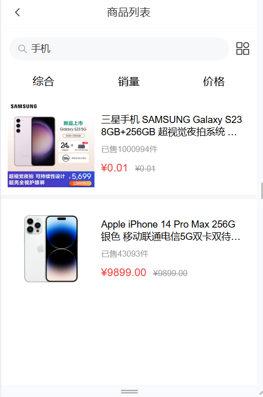
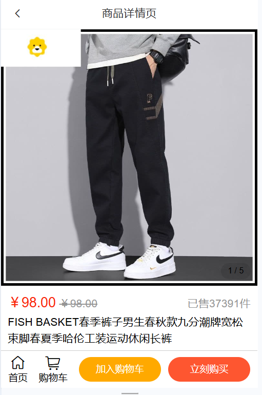

# 智慧商城 - Vue2 移动端电商项目

## 项目介绍

智慧商城是一个基于 Vue2 构建的移动端电商应用，提供完整的购物流程体验，包括商品浏览、搜索、购物车、订单管理等核心功能。

## 技术栈

- **前端框架**: Vue 2.6.14
- **路由管理**: Vue Router 3.5.1
- **状态管理**: Vuex 3.6.2
- **UI组件库**: Vant 2.13.9
- **HTTP客户端**: Axios 1.15.2
- **CSS预处理器**: Less
- **构建工具**: Vue CLI 5.0.0

## 项目功能

### 首页
- 搜索框支持关键词搜索
- 轮播图展示促销活动
- 商品分类导航（新品首发、居家生活、服饰鞋包等）
- 每日抄底等特色板块

### 分类页
- 商品分类浏览
- 综合/销量/价格排序
- 商品列表展示

### 商品详情页
- 商品图片展示
- 商品价格、销量信息
- 加入购物车/立即购买

### 购物车
- 商品列表管理
- 数量增减
- 价格计算

### 用户中心
- 用户登录/注册
- 订单管理
- 个人信息

## 项目效果展示

### 首页截图


### 商品列表页截图


### 商品详情页截图




## 安装步骤

### 1. 安装依赖

```bash
npm install
```

### 2. 启动开发服务器

```bash
npm run serve
```

### 3. 构建生产版本

```bash
npm run build
```

### 4. 代码检查

```bash
npm run lint
```

## 项目结构

```
├── public/           # 静态资源
│   └── index.html
├── src/
│   ├── api/          # API接口封装
│   ├── assets/       # 静态资源文件
│   ├── components/   # 公共组件
│   ├── mixins/       # 混入函数
│   ├── router/       # 路由配置
│   ├── store/        # Vuex状态管理
│   ├── style/        # 全局样式
│   ├── utils/        # 工具函数
│   ├── views/        # 页面组件
│   ├── App.vue       # 根组件
│   └── main.js       # 入口文件
└── package.json      # 项目配置
```

## 核心功能模块

| 模块 | 说明 |
|------|------|
| 首页 | 商品展示、轮播图、分类导航 |
| 分类页 | 商品分类浏览、排序筛选 |
| 搜索页 | 关键词搜索、搜索历史 |
| 商品详情 | 商品信息、购买操作 |
| 购物车 | 商品管理、价格计算 |
| 订单管理 | 订单列表、订单详情 |
| 用户中心 | 用户信息、登录注册 |

## 开发说明

- 项目使用 Vue CLI 5.x 构建
- 支持 ES6+ 语法
- 使用 Less 编写样式
- 采用移动端响应式设计
- 使用 Vant UI 组件库

## License

MIT
